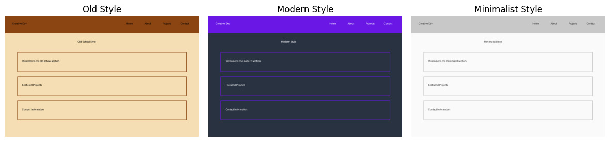
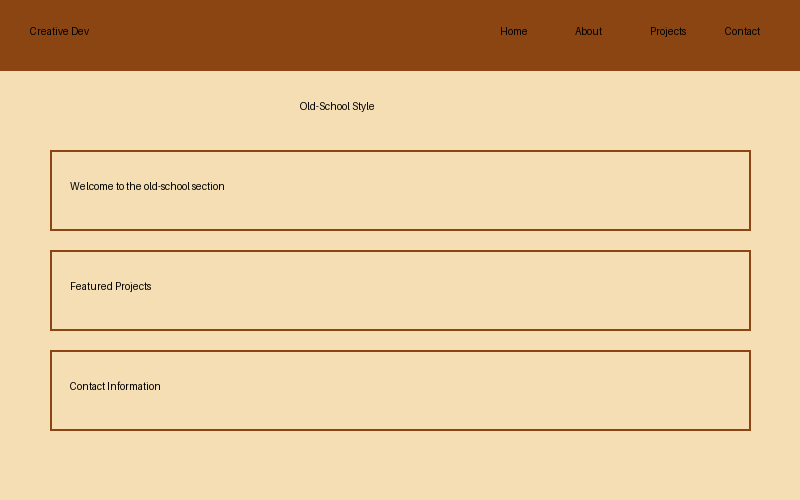
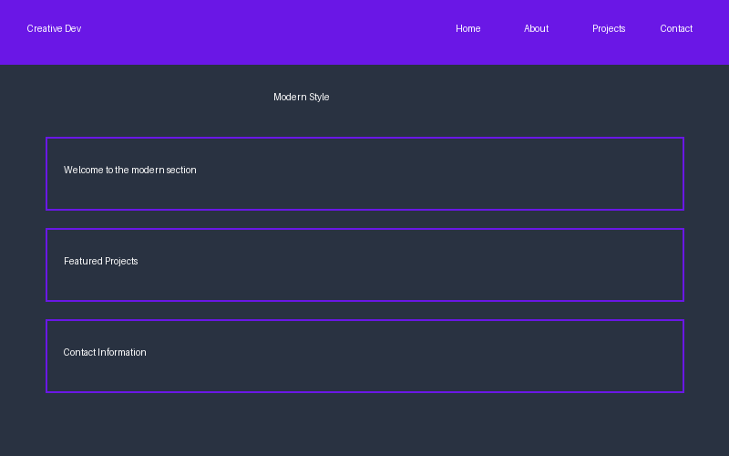
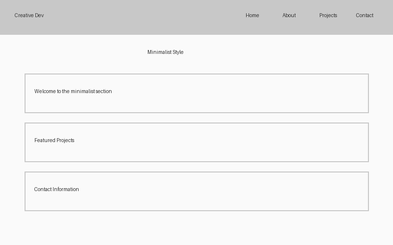
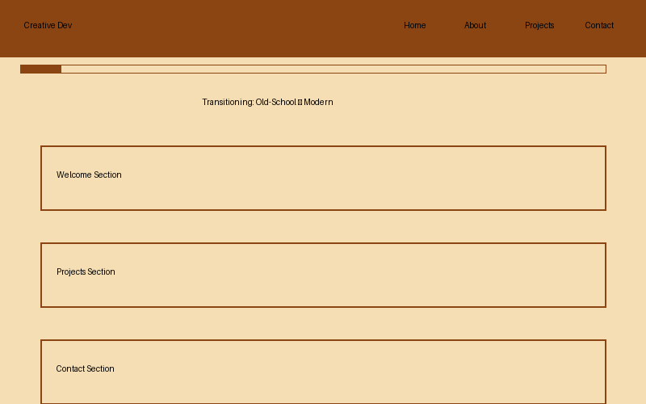
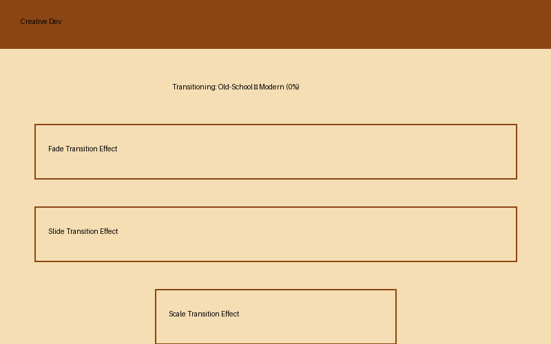

# Creative Developer Portfolio

A responsive portfolio website showcasing creative development work with three distinct visual styles: old-school, modern, and minimalist. This interactive website features smooth scroll-based transitions and animations to create an engaging user experience.



## Table of Contents
- [Features](#features)
- [Visual Styles](#visual-styles)
- [Technologies Used](#technologies-used)
- [Installation & Deployment](#installation--deployment)
- [File Structure](#file-structure)
- [Customization](#customization)
- [Performance Optimizations](#performance-optimizations)
- [Browser Compatibility](#browser-compatibility)
- [Credits & Acknowledgments](#credits--acknowledgments)

## Features

- **Responsive Design**: Optimized for mobile, tablet, and desktop devices
- **Three Visual Styles**: Old-school, modern, and minimalist aesthetics
- **Scroll-Based Animations**: Smooth transitions between sections as users scroll
- **Interactive Elements**: Dynamic content reveals and hover effects
- **Accessibility Features**: ARIA attributes, keyboard navigation, screen reader support
- **Performance Optimized**: Fast loading times with optimized assets
- **Cross-Browser Compatible**: Works on all modern browsers

## Visual Styles

The portfolio features three distinct visual styles that transition as users scroll through the website:

### Old-School Style


Features a retro aesthetic with:
- Wheat-colored background
- Brown accents
- Monospace typography
- Pixel-art inspired elements

### Modern Style


Features a contemporary look with:
- Dark blue background
- Vibrant purple accents
- Clean sans-serif typography
- Smooth animations and transitions

### Minimalist Style


Features a clean, minimal design with:
- White background
- Subtle gray accents
- Minimal decoration
- Focus on typography and whitespace

### Scroll Transitions

The website features smooth transitions between styles as users scroll:



Elements transition and transform based on scroll position:



## Technologies Used

### Core Technologies
- HTML5
- CSS3
- JavaScript (ES6+)

### Libraries & Frameworks
| Library | Version | Purpose |
|---------|---------|---------|
| [GSAP](https://greensock.com/gsap/) | 3.11.4 | Animation and scroll-based effects |
| [ScrollTrigger](https://greensock.com/scrolltrigger/) | 3.11.4 | Scroll-based animations |
| [Font Awesome](https://fontawesome.com/) | 6.4.0 | Icons |
| [Google Fonts](https://fonts.google.com/) | N/A | Typography |

## Installation & Deployment

### Prerequisites
- Web server (Apache, Nginx, etc.) or static site hosting service
- HTTPS certificate for secure connections (recommended)

### Local Development
1. Clone the repository
   ```bash
   git clone https://github.com/yourusername/creative-portfolio.git
   cd creative-portfolio
   ```

2. Open the project in your code editor

3. For local testing, use a local server:
   ```bash
   # Using Python
   python -m http.server 8000
   
   # Or using Node.js with http-server
   npx http-server
   ```

4. Visit `http://localhost:8000` in your browser

### Production Deployment

1. **Prepare the production files**
   - Use the files in the `dist` directory for production deployment
   - Ensure all image assets are properly optimized

2. **Upload to web server**
   ```bash
   # Example using rsync
   rsync -avz --delete dist/ username@your-server:/path/to/www/
   ```

3. **Configure server settings**
   - Set up proper caching headers using the included `.htaccess` file
   - Ensure GZIP compression is enabled
   - Configure SSL if using HTTPS

4. **Test the deployed website**
   - Verify all links work correctly
   - Test on multiple browsers and devices
   - Run performance tests using Lighthouse

## File Structure

```
portfolio-website/
├── assets/
│   ├── favicon/
│   │   ├── favicon.ico
│   │   ├── favicon-16x16.png
│   │   ├── favicon-32x32.png
│   │   └── apple-touch-icon.png
│   ├── fonts/
│   └── images/
│       ├── project1.jpg
│       ├── project2.jpg
│       ├── project3.jpg
│       └── social-share.jpg
├── css/
│   ├── style.css          # Main stylesheet
│   ├── old-school.css     # Old-school style specific CSS
│   ├── modern.css         # Modern style specific CSS
│   ├── minimalist.css     # Minimalist style specific CSS
│   └── loading.css        # Loading animation styles
├── js/
│   ├── script.js          # Main JavaScript file
│   └── loading.js         # Loading animation script
├── animations/            # Animation demonstrations
├── screenshots/           # Website style previews
├── index.html             # Main HTML file
├── demo.html              # Feature demonstration page
├── manifest.json          # Web app manifest
├── robots.txt             # Search engine instructions
├── sitemap.xml            # Site structure for search engines
└── README.md              # Project documentation
```

## Customization

See the [customization documentation](docs/customization.md) for detailed instructions on:
- Modifying content (text, images, projects)
- Changing visual styles
- Adding new sections
- Customizing animations and transitions

## Performance Optimizations

The website includes several performance optimizations:

- **Asset Optimization**
  - Minified CSS and JavaScript
  - Compressed image assets
  - Appropriate image formats and dimensions

- **Loading Techniques**
  - Lazy loading for below-the-fold images
  - Preloading of critical assets
  - Asynchronous loading of non-critical scripts

- **Caching Strategy**
  - Appropriate cache headers for static assets
  - Versioned file names for cache busting when updated

- **Rendering Performance**
  - Optimized CSS selectors
  - Hardware-accelerated animations
  - Reduced layout thrashing during animations

## Browser Compatibility

Tested and optimized for:
- Chrome (latest 2 versions)
- Firefox (latest 2 versions)
- Safari (latest 2 versions)
- Edge (latest 2 versions)
- iOS Safari (latest 2 versions)
- Android Chrome (latest 2 versions)

## Credits & Acknowledgments

- **Design Inspiration**: Modern portfolio trends research
- **Icons**: Font Awesome (free version)
- **Fonts**: Google Fonts (Roboto, Space Mono, Playfair Display)
- **Animation Library**: GSAP by GreenSock
- **Development**: Creative Developer

---

© 2025 Creative Developer. All rights reserved.